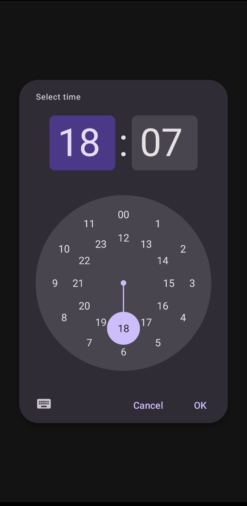
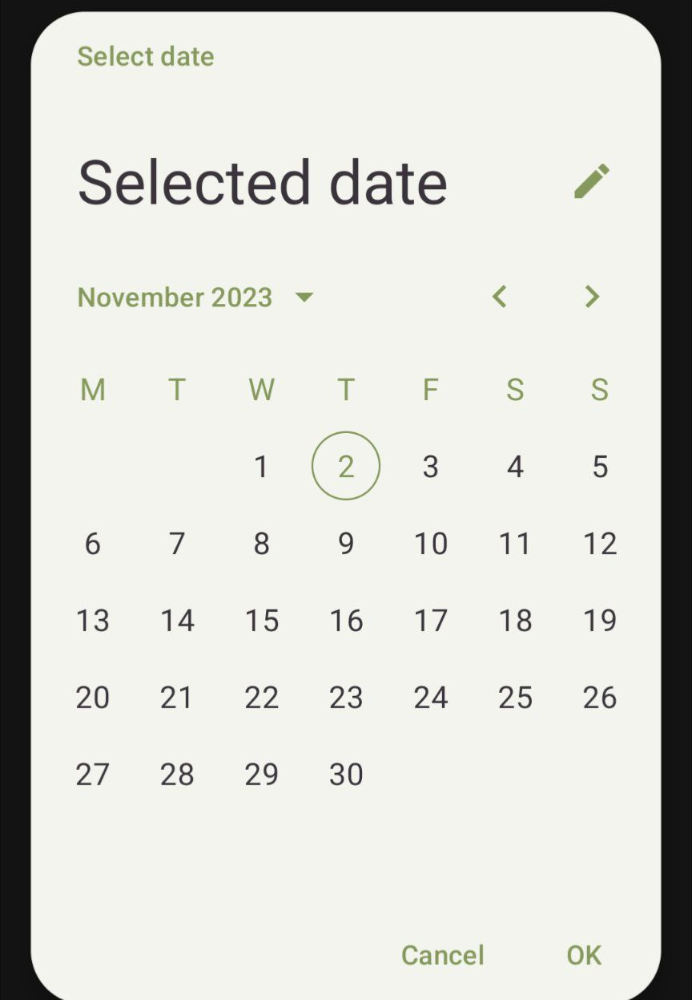
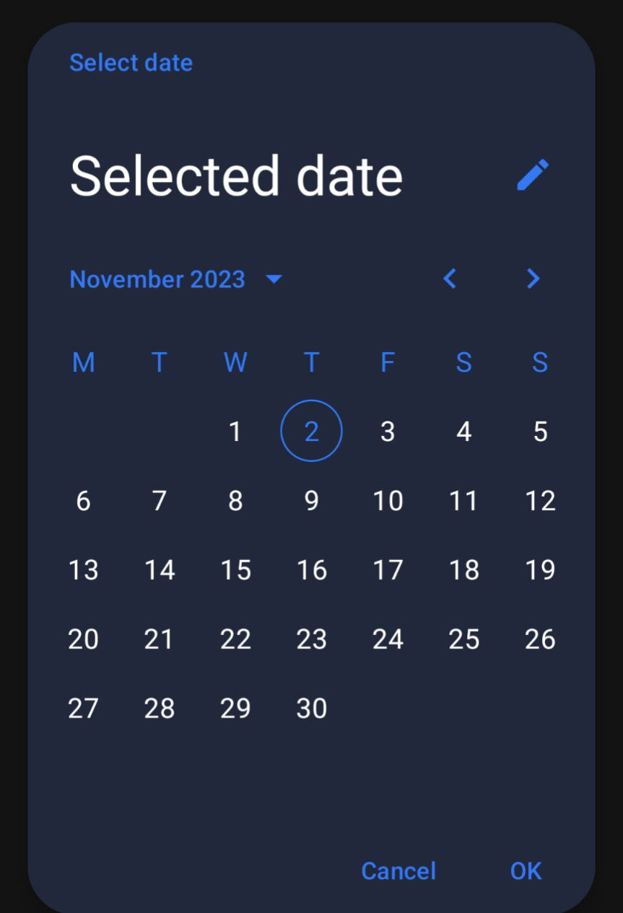

# React Native Material Design Datepicker

## Screenshots

<table>
  <tr>
    <td><p align="center"></p></td>
    <td><p align="center"></p></td>
    <td><p align="center"></p></td>
  </tr>
</table>

## Installation

```bash
npm install react-native-mdc-datepicker --save
```

or

```bash
yarn add react-native-mdc-datepicker
```

## MDCDatePicker Api

```ts
import { MDCDatePicker } from "react-native-mdc-datepicker"

MDCDatePicker.present(options ? : PickerDefaultOptions)
:
Promise <Date>

MDCDatePicker.presentRange(options ? : PickerRangeOptions)
:
Promise <{ start: Date, end: Date }>
```

## MDCTimePicker Api

```ts
import { MDCTimePicker } from "react-native-mdc-datepicker"

MDCTimePicker.present(options ? : TimePickerOptions)
:
Promise <{ hour: number, minute: number }>

```

## DatePicker Usage (Declarative Api)

```tsx
import { DatePicker } from 'react-native-mdc-datepicker';

const [visible, setVisible] = useState(false);
const [selected, setSelected] = useState<Date | null>(null);

return (
  <DatePicker
    visible={dateVisible}
    setVisible={setDateVisible}
    value={selected}
    minDate={minDate}
    dynamicColors
    maxDate={maxDate}
    onSelect={setSelected}
  />
)
```

## DateRangePicker Usage (Declarative Api)

```tsx
import { DatePicker } from 'react-native-mdc-datepicker';

const [visible, setVisible] = useState(false);
const [selectedRange, setSelectedRange] = useState<{
  start: Date | null;
  end: Date | null;
}>({ start: null, end: null });

return (
  <DatePicker
    mode="range"
    visible={rangeVisible}
    setVisible={setRangeVisible}
    minDate={minDate}
    maxDate={maxDate}
    onSelect={setSelectedRange}
    {...selectedRange}
  />
)
```

## TimePicker Usage (Declarative Api)

```tsx
import { TimePicker, type TimePickerResult } from 'react-native-mdc-datepicker';

const [visible, setVisible] = useState(false);
const [time, setTime] = useState<TimePickerResult | null>(null)
return (
  <TimePicker
    visible={visible}
    setVisible={setVisible}
    format="24"
    mode="clock"
    onSelect={setTime}
  />
)
```

## Usage (Imperative Api)

```tsx
const [selected, setSelected] = useState<Date | null>(null);

const [selectedRange, setSelectedRange] = useState<{
  start: Date | null;
  end: Date | null;
}>({ start: null, end: null });

const presentDefault = async () => {
  try {
    const date = await MDCDatePicker.present();
    setSelected(date);
  } catch (err) {
  }
}

const presentRange = async () => {
  try {
    const value = await MDCDatePicker.presentRange();
    setSelectedRange(val);
  } catch {
  }
}

```

## Picker Options

| Prop          | Type                                   | Required | Description                                         |
|---------------|----------------------------------------|----------|-----------------------------------------------------|
| value         | Date or null                           | NO       | Selected value                                      |
| initialDate   | Date                                   | NO       | Initially selected value                            |
| minDate       | Date                                   | NO       | Minimum date that can be selected                   |
| maxDate       | Date                                   | NO       | Maximum date that can be selected                   |
| fullScreen    | boolean (default - false)              | NO       | If true datepicker will be presented in full screen |
| dynamicColors | boolean (default - false)              | NO       | If true will aplly system dynamic colors            |
| title         | string                                 | NO       | Title of the picker                                 |
| confirmText   | string                                 | NO       | Confirm text of the picker                          |
| cancelText    | string                                 | NO       | Cancel text of the picker                           |
| theme         | 'system'(default) \| 'dark' \| 'light' | NO       | Defines picker theme                                |

## Range Picker Options

| Prop          | Type                                   | Required | Description                                         |
|---------------|----------------------------------------|----------|-----------------------------------------------------|
| start         | Date or null                           | NO       | Selected start value                                |
| end           | Date or null                           | NO       | Selected end value                                  |
| initialStart  | Date                                   | NO       | Initially selected value for start                  |
| initialEnd    | Date                                   | NO       | Initially selected value for end                    |
| minDate       | Date                                   | NO       | Minimum date that can be selected                   |
| maxDate       | Date                                   | NO       | Maximum date that can be selected                   |
| fullScreen    | boolean (default - true)               | NO       | If true datepicker will be presented in full screen |
| dynamicColors | boolean (default - false)              | NO       | If true will aplly system dynamic colors            |
| title         | string                                 | NO       | Title of the picker                                 |
| confirmText   | string                                 | NO       | Confirm text of the picker                          |
| theme         | 'system'(default) \| 'dark' \| 'light' | NO       | Defines picker theme                                |

## TimePicker Options

| Prop          | Type                                   | Required | Description                              |
|---------------|----------------------------------------|----------|------------------------------------------|
| value         | {hour, minute} \| null                 | NO       | Selected time                            |
| initialTime   | {hour, minute} \| null                 | NO       | Initially selected time                  |
| format        | '24' or '12'                           | NO       | Defines time format of the picker        |
| mode          | 'input' or 'clock'                     | NO       | Defines start mode of the picker         |
| dynamicColors | boolean (default - false)              | NO       | If true will aplly system dynamic colors |
| title         | string                                 | NO       | Title of the picker                      |
| confirmText   | string                                 | NO       | Confirm text of the picker               |
| cancelText    | string                                 | NO       | Cancel text of the picker                |
| theme         | 'system'(default) \| 'dark' \| 'light' | NO       | Defines picker theme                     |

# Customization

For customization pickers you need to define styles in your src/main/res/values/styles.xml

For different themes will be used different styles

You can learn about picker customization on resources:
<a href="https://github.com/material-components/material-components-android/blob/master/docs/components/DatePicker.md">
Date picker</a>,
<a href="https://github.com/material-components/material-components-android/blob/master/docs/components/TimePicker.md">
Time picker</a>

## Date Picker

```xml
<!-- theme = 'system' fullScreen={false}  -->
<style name="MaterialCalendarTheme" parent="BaseMaterialCalendarTheme"></style>
  <!-- theme = 'light' fullScreen={false}  -->
<style name="MaterialCalendarLightTheme" parent="BaseMaterialCalendarTheme"></style>
  <!-- theme = 'dark' fullScreen={false} -->
<style name="MaterialCalendarDarkTheme" parent="BaseMaterialCalendarTheme"></style>
```

```xml
<!-- theme = 'system' fullScreen={true} -->
<style name="MaterialCalendarFullScreenTheme" parent="BaseMaterialCalendarFullScreenTheme"></style>
  <!-- theme = 'dark' fullScreen={true} -->
<style name="MaterialCalendarFullScreenDarkTheme" parent="BaseMaterialCalendarFullScreenTheme"></style>
  <!-- theme = 'light' fullScreen={true} -->
<style name="MaterialCalendarFullScreenLightTheme" parent="BaseMaterialCalendarFullScreenTheme"></style>
```

## Time Picker

```xml
  <!-- theme = 'system' -->
<style name="MaterialTimePickerTheme" parent="BaseMaterialTimePickerTheme"></style>
  <!-- theme = 'dark' -->
<style name="MaterialTimePickerDarkTheme" parent="BaseMaterialTimePickerTheme"></style>
  <!-- theme = 'light' -->
<style name="MaterialTimePickerLightTheme" parent="BaseMaterialTimePickerTheme"></style>

```

## Example



```tsx
<DatePicker
  theme="light"
/>
```

```xml

<style name="MaterialCalendarLightTheme" parent="BaseMaterialCalendarTheme">
  <item name="colorPrimary">#809A54</item>
  <item name="colorOnPrimary">#3B333D</item>
  <item name="colorSurface">#FFFFFF</item>
  <item name="colorOnSurface">#3B333D</item>
  <item name="colorOnSurfaceVariant">#809A54</item>
</style>
```



```tsx
<DatePicker
  theme="dark"
/>
```

```xml

<style name="MaterialCalendarDarkTheme" parent="BaseMaterialCalendarTheme">
  <item name="colorPrimary">#007AFF</item>
  <item name="colorOnPrimary">#FFFFFF</item>
  <item name="colorSurface">#241f28</item>
  <item name="colorOnSurface">#FFFFFF</item>
  <item name="colorOnSurfaceVariant">#007AFF</item>
</style>
```


