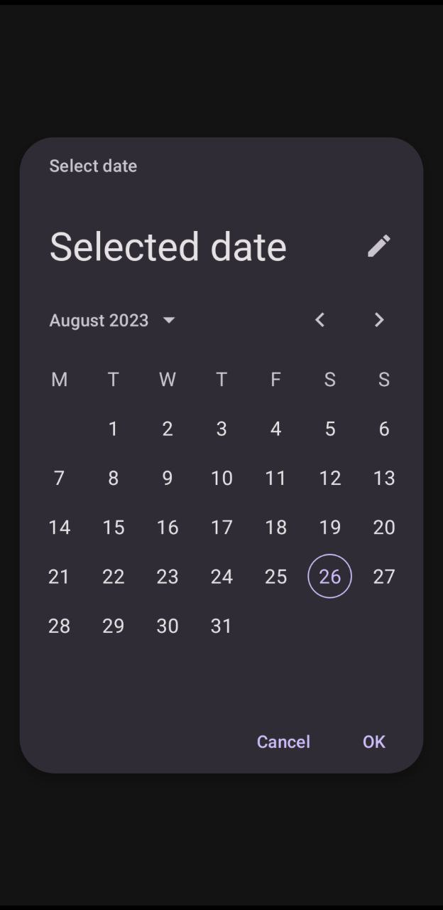
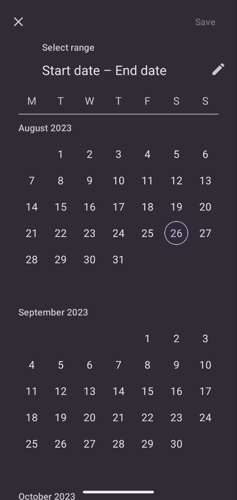

# React Native Material Design Datepicker

## Screenshots
<table>
  <tr>
    <td><p align="center"></p></td>
    <td><p align="center"></p></td>
    <td><p align="center"></p></td>
  </tr>
</table>

## Installation

```bash
npm install react-native-mdc-datepicker --save
```
or
```bash
yarn add react-native-mdc-datepicker
```

## MDCDatePicker Api

```js
import { MDCDatePicker } from "react-native-mdc-datepicker"

MDCDatePicker.present(options?: PickerDefaultOptions): Promise<Date>

MDCDatePicker.presentRange(options?: PickerRangeOptions): Promise<{start: Date, end: Date}>
```

## MDCTimePicker Api

```js
import { MDCTimePicker } from "react-native-mdc-datepicker"

MDCTimePicker.present(options?: TimePickerOptions): Promise<{hour: number, minute: number}>

```

## Usage (Imperative Api)
```js
const [selected, setSelected] = useState<Date | null>(null);

const [selectedRange, setSelectedRange] = useState<{
    start: Date | null;
    end: Date | null;
  }>({ start: null, end: null });

const presentDefault = async () => {
    try {
      const date = await MDCDatePicker.present();
      setSelected(date);
    } catch (err) {}
}

const presentRange = async () => {
    try {
      const value = await MDCDatePicker.presentRange();
      setSelectedRange(val);
    } catch {}
}

```


## Picker Options
| Prop | Type | Required | Description |
| --- | --- | --- | ---
| value | Date or null | NO | Selected value
| initialDate | Date | NO | Initially selected value
| minDate | Date | NO | Minimum date that can be selected
| maxDate | Date | NO | Maximum date that can be selected
| fullScreen | boolean (default - false) | NO | If true datepicker will be presented in full screen
| dynamicColors | boolean (default - false) | NO | If true will aplly system dynamic colors
| title | string | NO | Title of the picker
| confirmText | string | NO | Confirm text of the picker
| cancelText | string | NO | Cancel text of the picker

## Range Picker Options
| Prop | Type | Required | Description |
| --- | --- | --- | ---
| start | Date or null | NO | Selected start value
| end | Date or null | NO | Selected end value
| initialStart | Date | NO | Initially selected value for start
| initialEnd | Date | NO | Initially selected value for end
| minDate | Date | NO | Minimum date that can be selected
| maxDate | Date | NO | Maximum date that can be selected
| fullScreen | boolean (default - false) | NO | If true datepicker will be presented in full screen
| dynamicColors | boolean (default - false) | NO | If true will aplly system dynamic colors
| title | string | NO | Title of the picker
| confirmText | string | NO | Confirm text of the picker


## TimePicker Options

| Prop | Type | Required | Description |
| --- | --- | --- | ---
| format | '24' or '12' | NO | Defines time format of the picker
| mode | 'input' or 'clock' | NO | Defines start mode of the picker
| dynamicColors | boolean (default - false) | NO | If true will aplly system dynamic colors
| title | string | NO | Title of the picker
| confirmText | string | NO | Confirm text of the picker
| cancelText | string | NO | Cancel text of the picker


